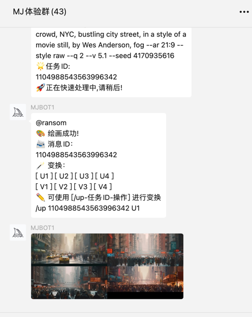

### 开始将你的微信机器人接入 Midjourney 服务吧

-  第一步，将项目拉取到你的本地

    `git clone https://github.com/HelloAIDE/midjourney-wechat.git`
- 第二步，将目录下的`config.yaml.example`文件名修改为`config.yaml`，然后修改里面的`api_key`选项

    ```yaml
  # MJ_API接口地址
    api_url: http://mj-api.168api.cn
    # 你的API密钥，可联系微信geek_bigniu获取
    api_key: xxx
    # 检查消息是否已处理，防止同一群多个机器人重复处理
    check_url: http://check.168api.cn
    # 下载discord图片的代理配置，非全局
    proxy:
    # 是否开启代理 开启true 关闭false
    use_proxy: false
    # 代理地址 只有开启时生效
    proxy_url: "http://127.0.0.1:7890"
    #发信邮件配置，请修改为你的邮箱
    smtp:
    host: smtp.gmail.com
    port: 587
    username: xxx@gmail.com
    password: xxxx
    # 掉线通知收件邮箱配置
    mail:
    sender: xx@gmail.com
    # 收件邮箱，可填写多个，多了可能会进垃圾箱
    to:
    - xx@qq.com
    subject: MJBOT机器人需要登陆提醒
    body:
    请扫描下方二维码进行登陆
  ```
-  第四步，编译并打包

    在根目录执行`go build`命令即可打包出支持你当前平台的程序

### 付费及说明
- 由于Midjourney官方收费的原因，所以白嫖基本不可能的。。。
- 关于价格这块可以咨询微信`geek_bigniu`，可试用

### 使用截图

